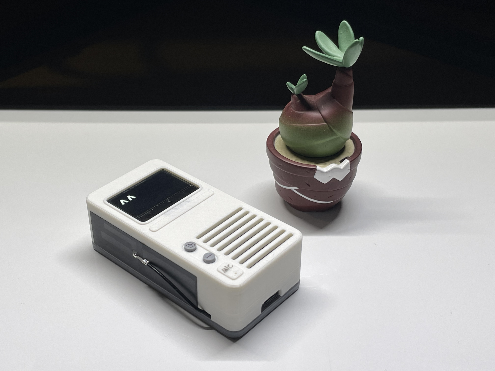
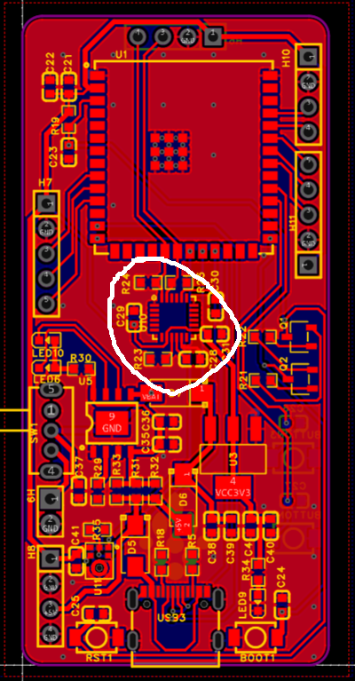

# IRIS-ChatBot-v0.1

[视频链接](https://www.bilibili.com/video/BV1xz421S7d6/?spm_id_from=333.788.0.0&vd_source=6993c687c4c026d4a88b3e5712b40113)

想复刻请注意，这个项目的PCB本来不是用来做这个对话机器人的，我只是清一下库存！

MPU6050的外围电路用不到也不用焊！板子上的ICS-43434也可以不用焊（这东西太难焊了，焊好几块都收不到音），直接用模块更好！

